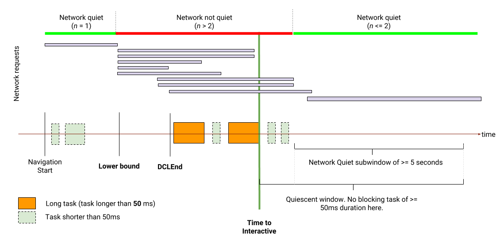

Time to Interactive Explainer
============================

Web developers require more information on page load performance in the wild. No single moment in time completely captures the "loading experience". To give developers insight into the loading experience, we propose a set of key progress metrics to capture the series of key moments during pageload which developers care about. Time to Interactive (TTI) is the last and most important of these key moments, following [First Paint](https://w3c.github.io/paint-timing/#first-paint) (FP) and [First Contentful Paint](https://w3c.github.io/paint-timing/#first-contentful-paint) (FCP).

Time to Interactive (TTI) is a page load performance metric that measures how long it takes for a web page to become interactive, which is defined as the point where: 

1.  The page has displayed useful content
1.  Event handlers are registered for most visible page elements
1.  When a user interacts with the page, the page consistently responds within 50ms - the user does not experience jank.

Web developers often use the Onload signal to measure this today, but Onload correlates poorly with the user's perception of page load time. TTI is intended to be a better alternative for measuring page load time.


## Objectives

Many sites optimize content visibility at the expense of interactivity. We often see multi-second delays between paint metrics and interactivity. We want to:

*   Motivate developers to ensure their sites are interactive quickly
*   Incentivize developers to eliminate, break up, or front-load their long tasks

We believe that the best way to accomplish these objectives is for the metric to:

* Correlate reasonably closely with an intuitive definition of how interactive a page is.
* Behave the same in the lab and in the wild.

## API

We propose adding a `PerformanceInteractiveTiming` interface.

```javascript
interface PerformanceInteractiveTiming : PerformanceEntry {};
```

* The name attribute must return "interactive"
* The entryType attribute must return "interactive".
* The startTime attribute must return a DOMHighResTimeStamp of when the page became interactive.
* The duration attribute must return 0.

```javascript
var observer = new PerformanceObserver(function(list) {
  var perfEntries = list.getEntries();
  for (var i = 0; i < perfEntries.length; i++) {
     // Process entries
     // report back for analytics and monitoring
     // There should be exactly one entry if the page already reached
     // Page Interactive, otherwise there should be none.
  }
});

// Register observer for Time to Interactive timing notifications.
observer.observe({entryTypes: ["interactive"]});
```

## Definition

Detecting when the page has displayed useful content and event listeners are registered for most visible elements in full generality is impossible, so we use a combination of observing main thread and network activity and listening to signals like DomContentLoadedEnd and FirstContentfulPaint for this metric. At a high level, the current definition looks for a big enough time window on the browsing context event loop such that the window contains no long tasks (so we know that the event loop will be ready to ready to user input quickly), and the window contains a five second sub-window of network quiet (so we know that the page is mostly done loading resources and some newly downloaded resource is unlikely to set off heavy processing.) 

The precise algorithmic definition is as follows:


*   Pick a lower bound. Mark the window start time as this lower bound.
    *   We currently use First Meaningful Paint. 
*   Move the window end point forwards until either:
    *   A task on the browsing context event loop with duration > 50ms is encountered.
        *   In this case, reset the window start time to the end of this long task and continue growing the window.
    *   Or, last 5 seconds of the window is _network quiet_.
        *   Go to next step in this case.
        *   Currently we call a time interval network quiet if it contains a maximum of two simultaneous resource requests at any given time. We exclude failed resource requests and resource requests that are not made with the GET HTTP method. Forgiving up to two requests allows us to still reach network quiescence on sites that have long running network requests, for example to perform long polling.
        * Note that since we reset the window when we encounter a long task, at this point the window is at least 5 seconds long and contains no task on the browsing context event loop > 50ms in addition to being network quiet.
*   Report the start time of the window at TTI.
    *   If DOMContentLoadedEnd occurs after the start of the window, report that as TTI.
        *   We do not want to consider a page interactive before document finishes parsing. 

Schematic diagram of the definition: 




### Planned changes to the definition

*   We cannot use First Meaningful Paint as lower bound since that is not standardized yet. Other contenders for lower bound include:
    *   First Contentful Paint
    *   Dom Content Loaded
    *   Developers instrumenting when they're done adding event listeners
*   Update the network quiet heuristic
    *   Currently we only look at the number of simultaneous network requests. We can do better by paying attention to resource type and contents.

## Frequently Asked Questions

**Why do we need a network quiet heuristic? Is it not enough to look at main thread activity plus DOMContentLoaded and First Meaningful/Contentful Paint?**

Critical javascript resource loads (resources needed to make the web page interactive and resources that will set off long tasks) often start after FMP/DCL and take more than 5 seconds to load, especially on slow networks,  We need a signal for when we are mostly done loading subresources, which our network quiet heuristic provides.

**Doesn't TTI fail with a single long network request containing the whole app bundle?**

In theory it does, but in the wild this scenario is extremely rare. There are usually either enough parallel network requests, or the page does not reach First Meaningful Paint before that the single long network request. This scenario is more common in development environments where the resource bundle is not properly split. We recommend performance tools provide the ability to specify a custom lower bound in this case to get around this issue.

**Does TTI block until network is quiet?**

We cannot _detect_ TTI until network is quiet, but the actual TTI value is always at the end of a long task. For example, if there is a page where the last long task ends at 5s, but it downloads 50 images afterwards that take 20 more seconds to finish downloading, we may not be able to detect TTI until around 25s when most of those images are finished downloading, but the TTI value will still be 5s. 

**Why are we excluding non-GET requests?** 
The point of the network quiet heuristic is to block detecting TTI until the page has fetched all the critical resources. Non-GET requests, like POST, are almost never used to fetch resources. During page load, their purpose is usually to report back analytis data, so it is safe to exclude them.

**Why do we take the max of DCLEnd and the stat of quiet window, as opposed to simply stating the max of FMP, DCLEnd, and the start of quiet window?**

They're subtly different. The Imagine this scenario: 
```
FMP      DCLEnd     Long Task      

|        |          |

|<- 2 -> | <-  4  ->|

|<----6 seconds---->|
```

With taking max(FMP, DCLEnd) as lower bound, TTI will fire after the long task. 
If we use max(DCLEnd, TTI) at the end instead, TTI will fire at DCLEnd. 

We decided in this particular case, it is more appropriate to declare TTI at DCLEnd. 

## Things to note

*   TTI is not a real-time metric. We have to wait at least 5 seconds after the page actually becomes interactive before we can report it.
*   Unlike the Onload event, it is not enough for a page to load all resources and initialize all event handlers to reach TTI. The page has to consistently keep all its main thread activity under the 50ms budget. 
